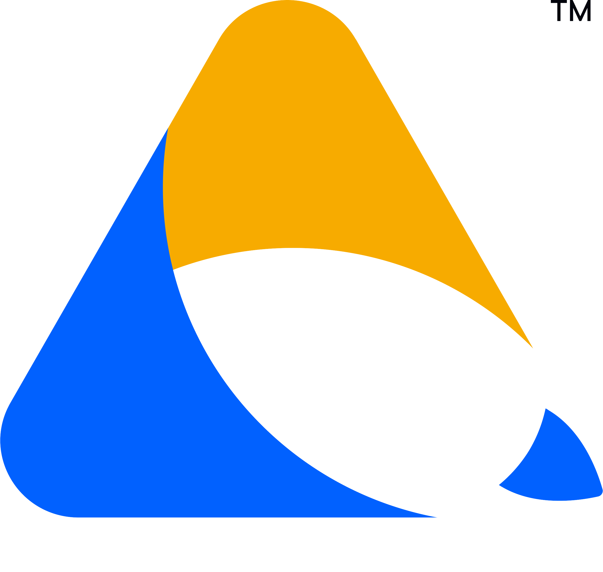

# 🌟 Welcome to the Zazz Tech Hub 🌟 

This GitHub space is where **tech meets talent** — a vibrant platform by **Zazz**, a Staff Augmentation-first powerhouse, helping elite teams scale with top-tier engineers across **LATAM and beyond**. But we’re not just about placements — we’re about **empowering the next generation of DevOps professionals**.

---

## 🚀 What You’ll Find Here

### 🔧 DevOps DeepDive  
From CI/CD pipelines to real-world cloud scaling challenges, our repositories reflect how DevOps works **in the wild**.

### 💼 Job-Ready Repositories  
Sample projects, automation scripts, and boilerplates designed to **showcase skills** and kickstart your career journey.

### 📘 Career Insights  
Real-world advice, guides, and interview prep material curated by engineers, for engineers.

### 🤝 Open Contributions  
We believe in the power of community. Found a bug? Got a better solution? **Fork it, fix it, and let's build together.**

---

## 👨‍💻 Who Is This For?

- **Hiring managers** looking for proven tech talent  
- **Engineers** leveling up or looking for their next role  
- **Open source contributors** who love to build with purpose

---

## 🎯 Why Zazz?

- 🌎 LATAM's leading Staff Augmentation experts  
- 🧠 Tech-led culture built on transparency and trust  
- 🚀 Projects across Fortune 500s and disruptive startups  
- 🤝 Real collaboration, not just contract placements

---

## 📲 Let’s Connect

🔗 [Website](https://www.zazz.io)  
💼 [LinkedIn](https://www.linkedin.com/company/zazz-io/)  
📸 [Instagram](https://www.instagram.com/zazz.io/)  
🐦 [Twitter](https://twitter.com/zazz_io)

---

> “At Zazz, we don’t just find you a job — we **amplify your career**.”

